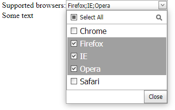

<!-- default badges list -->

<!-- default badges end -->
# DropDownEdit for ASP.NET Web Forms - How to emulate combo box with multiple selection
<!-- run online -->
**[[Run Online]](https://codecentral.devexpress.com/e2317/)**
<!-- run online end -->

This example demonstrates how you can use a combination of the [ASPxDropDownEdit](https://docs.devexpress.com/AspNet/DevExpress.Web.ASPxDropDownEdit) and [ASPxListBox](https://docs.devexpress.com/AspNet/DevExpress.Web.ASPxListBox) editors to emulate a combo box that allows end-users to select multiple items within its dropdown list.

## Files to Review

* [Default.aspx](./CS/Default.aspx) (VB: [Default.aspx](./VB/Default.aspx))
* [Default.aspx.cs](./CS/Default.aspx.cs) (VB: [Default.aspx.vb](./VB/Default.aspx.vb))

## Online Demo

* [CheckComboBox Emulation](https://demos.devexpress.com/ASPxEditorsDemos/ASPxDropDownEdit/CheckComboBox.aspx)
